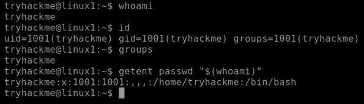
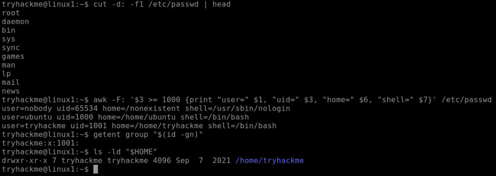
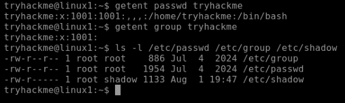
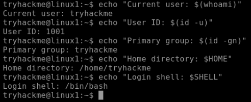
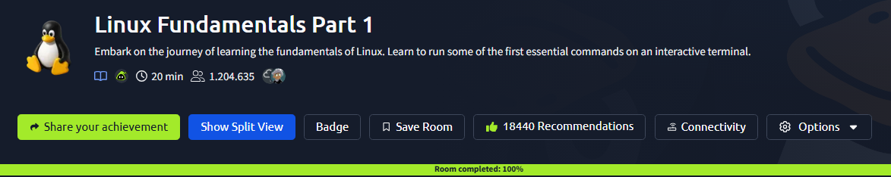

# 01 - Linux User Management

| Information | Details |
|---|---|
| Difficulty | Beginner |
| Category | Linux & Access Control |
| Platform | TryHackMe |
| Related Google Module | Tools of the Trade: Linux and SQL — Module 3 |

---

## Overview

This lab focuses on basic Linux user identity and account information. I reviewed how Linux identifies users, where account information is stored, and why separate user accounts are important for access control and system security.

---

## Learning Goal

My goal was to understand how Linux users are identified and managed at a basic level. I also wanted to see how user accounts, user IDs, groups, and protected account files work together in a Linux environment.

---

## What I Practiced

- Checking the current user and identity information
- Reviewing user IDs and group details
- Examining Linux user account files
- Understanding how protected account information is stored
- Creating a new user and assigning a primary group
- Verifying user and group information

---

## Google Cybersecurity Connection

The basic Linux user management concepts in this lab connect to the **Tools of the Trade: Linux and SQL** course in the Google Cybersecurity Certificate.

In Module 3, I reviewed how Linux uses the Bash shell to authenticate and authorize users. I then practiced creating a user, assigning the account to a group, and verifying the result with Linux commands.

---

## Command Notes

- `whoami` helped me confirm which user was currently active.
- `id` showed the user ID, primary group, and group membership information.
- `/etc/passwd` provided basic information about local user accounts.
- `/etc/shadow` showed why sensitive account information requires stronger protection.
- `useradd` was used to create a new user account.
- `usermod -g` was used to assign the user to a primary group.

---

## Screenshots

### TryHackMe Practice

#### Current User and Identity

I checked the current user and reviewed the identity information connected to the account.

#### User Account Review

I reviewed basic Linux user account information and how users are represented in the system.

#### Account Files and Protection

I examined account-related files and noted why sensitive user information must be protected.

#### User Environment Summary

I reviewed the main user and environment details covered during the lab.

#### Room Completion

This screenshot shows the completion of the related TryHackMe room.

---

## Result

### What I Learned

I learned how Linux identifies users through user IDs and groups, and how basic account information is stored in the system. I also understood why separating users and protecting sensitive account files are important for system security.

### What I Found Most Useful

The most useful part was using the `id` command to verify user and group information after making an account change.

### Next Step

The next lab continues with Linux permissions and least privilege to examine how access to files and directories can be controlled.
