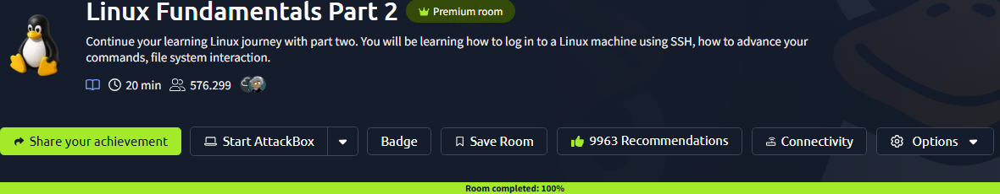
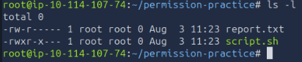
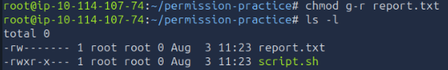

# 02 - Linux Permissions and Least Privilege

| Information | Details |
|---|---|
| Difficulty | Beginner |
| Category | Linux & Access Control |
| Platform | TryHackMe |
| Related Google Module | Tools of the Trade: Linux and SQL — Module 3 |

---

## Overview

This lab focuses on Linux file permissions and the principle of least privilege. I reviewed how read, write, and execute permissions are assigned to owners, groups, and other users.

I also practiced identifying unnecessary permissions and removing access that was not required.

---

## Learning Goal

My goal was to understand how Linux permissions control access to files and directories. I also wanted to practice reviewing permissions and making small changes that reduce unnecessary access.

---

## What I Practiced

- Reading symbolic Linux permissions
- Comparing owner, group, and other permissions
- Reviewing file permissions with `ls -l`
- Changing permissions with `chmod`
- Removing unnecessary group and other-user access
- Applying the principle of least privilege
- Verifying permission changes in the terminal

---

## Google Cybersecurity Connection

The permission concepts practiced in this lab connect to the **Tools of the Trade: Linux and SQL** course in the Google Cybersecurity Certificate.

In Module 3, I reviewed file ownership, authorization, and Linux permission commands. During the related activity, I identified a file that allowed write access for other users and removed the unnecessary permission with `chmod o-w`.

---

## Permission Notes

Linux permissions are divided into three areas:

- **Owner:** The user who owns the file
- **Group:** Users who belong to the file's assigned group
- **Others:** All remaining users on the system

The letters `r`, `w`, and `x` represent read, write, and execute permissions.

I used `ls -l` to review the current permissions and `chmod` to remove access that was not needed. This helped me understand how small permission changes can support least privilege and reduce unnecessary exposure.

---

## Screenshots

### TryHackMe Practice

#### Room Overview and Completion

I completed the Linux Fundamentals Part 2 room, which includes file access, users, groups, and Linux permission concepts.

#### Permission Review

I created two practice files with different permission settings and reviewed the owner, group, and other permissions with `ls -l`.

#### Least Privilege Change

I removed the group read permission from `report.txt` and verified that only the owner retained access to the file.

---

## Result

### What I Learned

I learned how to read Linux file permissions and identify which permissions belong to the owner, group, and other users. I also understood how unnecessary permissions can create avoidable security risks.

### What I Found Most Useful

The most useful part was comparing the permission output before and after using `chmod`. This made the effect of each permission change easier to understand.

### Next Step

The next lab moves into network traffic analysis with Wireshark, where I will begin reviewing packets, protocols, and basic network communication.
