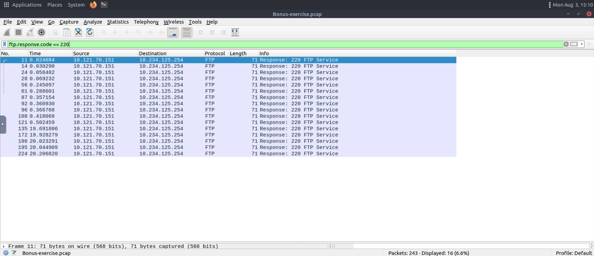
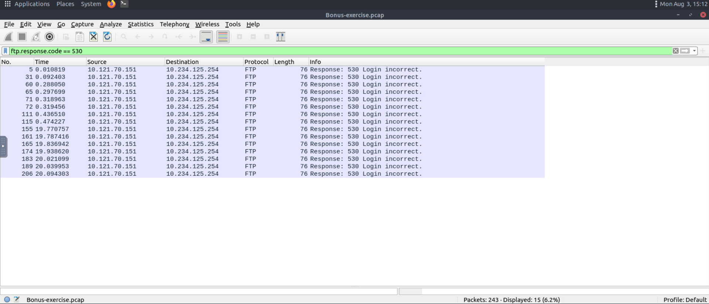
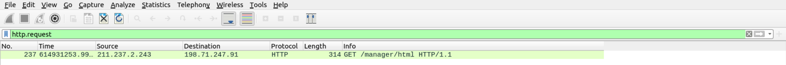
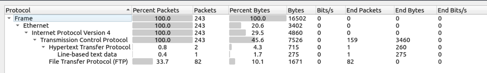

# 03 - Wireshark Traffic Analysis

| Information | Details |
|---|---|
| Difficulty | Beginner |
| Category | Network Discovery & Packet Analysis |
| Platform | TryHackMe |
| Related Google Module | Connect and Protect: Networks and Network Security — Module 1 |

---

## Overview

This lab focuses on reviewing network traffic with Wireshark. I used display filters to separate FTP and HTTP packets, checked repeated login failures, and reviewed the overall protocol distribution in a packet capture.

The aim was not to inspect every packet individually, but to identify useful patterns and understand how filtered traffic can support a basic security review.

---

## Learning Goal

My goal was to become more comfortable with Wireshark and understand how display filters make packet analysis easier.

I also wanted to practice recognizing normal protocol responses, repeated authentication failures, HTTP requests, and the general structure of captured network traffic.

---

## What I Practiced

- Opening and reviewing a packet capture
- Applying Wireshark display filters
- Filtering FTP response codes
- Identifying repeated failed FTP login attempts
- Reviewing source and destination IP addresses
- Filtering HTTP requests
- Examining protocol distribution with Protocol Hierarchy
- Avoiding the exposure of passwords and other sensitive data

---

## Google Cybersecurity Connection

The network concepts practiced in this lab connect to the **Connect and Protect: Networks and Network Security** course in the Google Cybersecurity Certificate.

In Module 1, I reviewed network architecture, network communication, the TCP/IP model, and the OSI model. This TryHackMe lab gave me a practical opportunity to observe some of those concepts inside real packet capture data.

---

## Traffic Observations

- The filter `ftp.response.code == 220` isolated FTP service-ready responses.
- The filter `ftp.response.code == 530` showed repeated failed login responses.
- Several `530 Login incorrect` packets appeared between the same source and destination systems. I treated this as a pattern worth reviewing rather than immediately assuming it was malicious.
- The `http.request` filter revealed an HTTP `GET` request to `/manager/html`.
- Protocol Hierarchy showed that the capture contained 243 packets and that FTP represented a noticeable part of the traffic.
- Filtering reduced the amount of visible traffic and made specific activity easier to review.

---

## Screenshots

### Filtered FTP Service Traffic

I filtered FTP response code `220` to review service-ready responses without exposing usernames or passwords.

### Failed FTP Login Analysis

I used response code `530` to isolate repeated failed FTP login attempts.

### HTTP Request Review

I applied the `http.request` filter and identified an HTTP `GET` request between two systems.

### Protocol Hierarchy Summary

I reviewed the overall packet and protocol distribution to understand the structure of the capture.

---

## Result

### What I Learned

I learned how Wireshark display filters can reduce a large packet capture into smaller groups of relevant traffic. I also became more comfortable reviewing protocol responses, IP communication, and repeated authentication failures.

### What I Found Most Useful

The most useful part was filtering FTP response codes. It allowed me to separate normal service responses from failed login activity without displaying sensitive credentials.

### Next Step

The next lab will focus on Nmap host discovery and basic enumeration to understand how active systems and exposed network services can be identified.

---

## Key Takeaway

This lab helped me understand that packet analysis is not only about opening a capture file. The main value comes from filtering the traffic, recognizing patterns, and deciding which activity deserves closer review.
