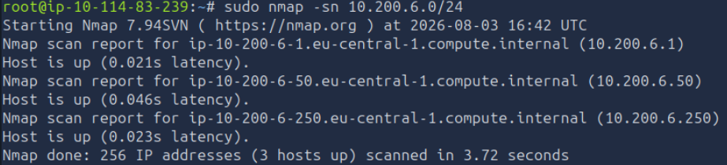
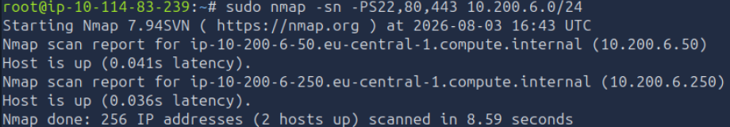
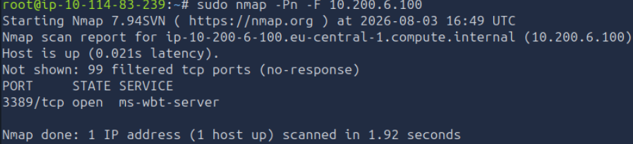

# 04 - Nmap Host Discovery

| Information | Details |
|---|---|
| Difficulty | Beginner |
| Category | Network Discovery & Packet Analysis |
| Platform | TryHackMe |
| Related Google Module | Connect and Protect: Networks and Network Security — Module 1 |

---

## Overview

This lab focuses on discovering active systems in a network with Nmap. I compared different host discovery methods and observed that the same network can produce different results depending on the probes used during the scan.

I also reviewed a host that did not respond to the initial discovery scans and used `-Pn` to continue the assessment without relying on the normal host discovery stage.

---

## Learning Goal

My goal was to understand how Nmap identifies active hosts and why a system may not appear in every discovery scan.

I also wanted to compare a standard ping scan with TCP SYN discovery and practice using `-Pn` when a known target does not respond to the initial probes.

---

## What I Practiced

- Scanning a `/24` network for active hosts
- Using `-sn` for host discovery without a port scan
- Using TCP SYN probes on selected ports
- Comparing discovery results from different scan methods
- Recognizing that filtered systems may not answer normal probes
- Using `-Pn` to skip the host discovery stage
- Performing a fast port scan on a specific target
- Reviewing open and filtered TCP ports

---

## Google Cybersecurity Connection

The networking concepts practiced in this lab connect to the **Connect and Protect: Networks and Network Security** course in the Google Cybersecurity Certificate.

In Module 1, I reviewed network architecture, IP addresses, network communication, and the TCP/IP model. This TryHackMe lab helped me apply those foundations while identifying active systems and reviewing how hosts respond to different types of network probes.

---

## Enumeration Notes

- The initial `-sn` scan checked 256 IP addresses in the `10.200.6.0/24` network and identified three active hosts.
- TCP SYN discovery using ports `22`, `80`, and `443` identified only two hosts.
- The difference between the two scans showed that discovery results can depend on the probes used and how systems are configured to respond.
- The Windows target at `10.200.6.100` did not appear in the first discovery results.
- Using `-Pn` allowed the scan to continue by treating the target as active.
- The fast scan showed that `3389/tcp` was open while the remaining scanned TCP ports were filtered.
- I did not treat a missing discovery response as proof that the host was offline.

---

## Screenshots

### Live Host Discovery

I used a standard Nmap ping scan to review the `10.200.6.0/24` network and identify responding hosts.

### TCP SYN Host Discovery

I used TCP SYN probes on ports `22`, `80`, and `443` and compared the results with the initial discovery scan.

### Windows Host Discovery with `-Pn`

The Windows target did not respond to the normal discovery probes, so I used `-Pn` and confirmed that the system was active with port `3389/tcp` open.

---

## Result

### What I Learned

I learned that host discovery is not always a simple online-or-offline check. Firewalls and system configurations can affect which probes receive a response, so different discovery methods may produce different results.

### What I Found Most Useful

The most useful part was using `-Pn` on a target that did not appear in the original scan. It showed me why an unanswered discovery probe should not automatically be interpreted as an inactive host.

### Next Step

The next lab will focus on basic log analysis and how recorded system events can be reviewed to identify useful security information.
