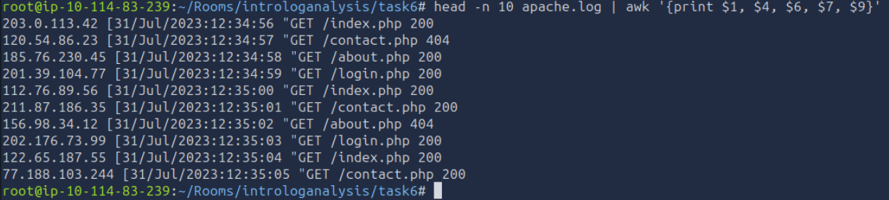
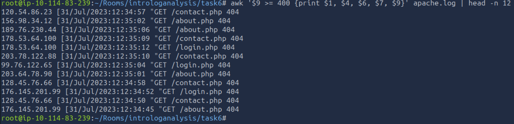
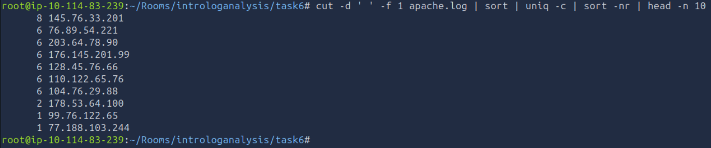
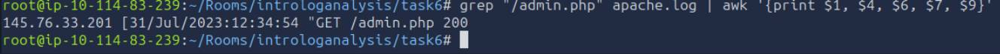

# 05 - Log Analysis Basics

| Information | Details |
|---|---|
| Difficulty | Beginner |
| Category | SOC Logs & Alert Triage |
| Platform | TryHackMe |
| Related Google Module | Google Cybersecurity Certificate — Detection and Response |

---

## Overview

This lab focuses on reviewing an Apache access log with basic Linux command-line tools. I extracted useful fields, filtered HTTP errors, counted repeated IP addresses, and searched for a request to an administrative page.

The aim was to understand how a large log file can be reduced into smaller and more useful results before starting a deeper investigation.

---

## Learning Goal

My goal was to become more comfortable reading structured web server logs and filtering the information I needed.

I also wanted to practice identifying HTTP errors, repeated requests, and specific page activity without manually reading every line in the file.

---

## What I Practiced

- Reviewing Apache access log entries
- Extracting useful fields with `awk`
- Filtering HTTP status codes
- Identifying requests with status codes of `400` or higher
- Extracting IP addresses with `cut`
- Counting repeated IP addresses with `sort` and `uniq`
- Searching for specific page requests with `grep`
- Keeping log output short and readable

---

## Google Cybersecurity Connection

This lab connects to the detection and response topics covered in the Google Cybersecurity Certificate.

The course introduced the importance of logs during security monitoring and investigations. In this TryHackMe lab, I reinforced that knowledge by reviewing web server activity and filtering records from the command line.

---

## Log Observations

- The Apache log contained client IP addresses, timestamps, HTTP methods, requested pages, and response status codes.
- I used `awk` to display only the fields that were useful for the review.
- Filtering status codes of `400` or higher showed several `404` responses for pages such as `/contact.php`, `/about.php`, and `/login.php`.
- Counting requests showed that `145.76.33.201` appeared eight times, which was the highest count in the displayed results.
- The same IP also requested `/admin.php` and received an HTTP `200` response.
- I treated the request count and administrative page access as points worth reviewing, but not as proof of malicious activity on their own.

---

## Screenshots

### Apache Log Structure

I reduced the original Apache log entries to the main fields needed for a basic review: IP address, timestamp, HTTP method, requested page, and response code.

### HTTP Error Review

I used `awk` to filter log entries with HTTP status codes of `400` or higher.

### Top Requesting IP Addresses

I extracted the source IP addresses, counted repeated entries, and sorted the results by request volume.

### Administrative Page Request

I used `grep` and `awk` to locate the request made to `/admin.php` and display its main fields.

---

## Result

### What I Learned

I learned how basic Linux commands can make a log file easier to review. Instead of reading every full entry, I was able to extract specific fields, filter error responses, count repeated IP addresses, and search for a particular page.

### What I Found Most Useful

The most useful part was combining several commands with pipes. Using `cut`, `sort`, and `uniq` together made it easier to identify which IP addresses appeared most often.

### Next Step

The next lab will focus on SIEM alert triage and how security alerts can be reviewed, prioritized, and prepared for further investigation.
