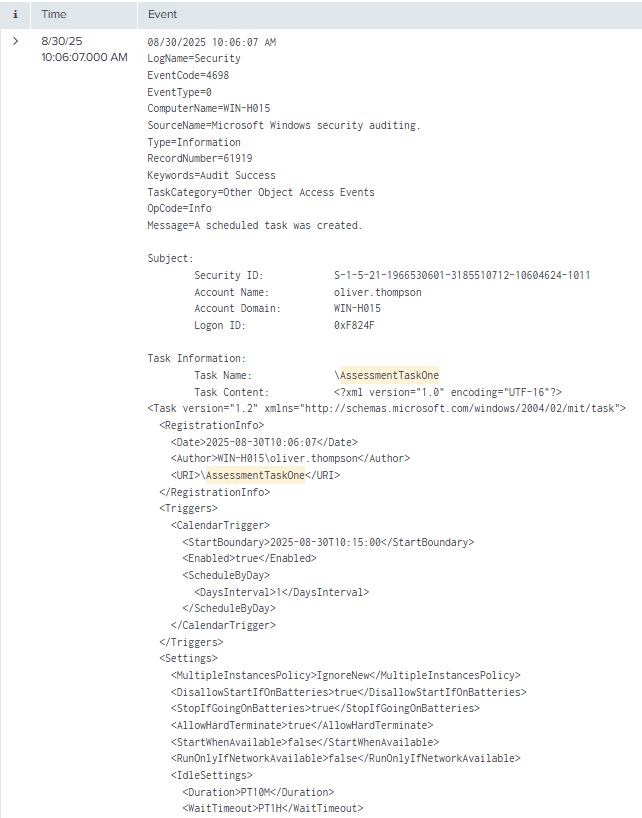
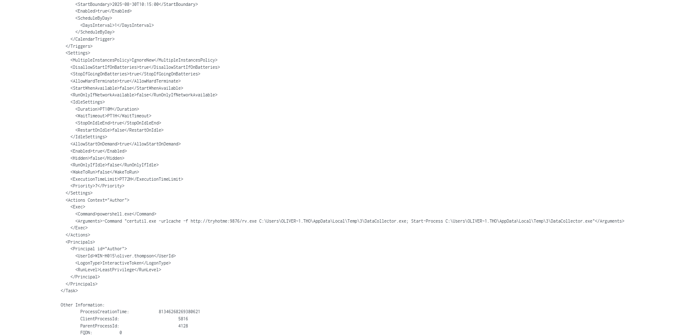
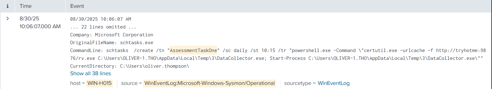

# 06 - SIEM Alert Triage

| Information           | Details                                 |
| --------------------- | --------------------------------------- |
| Difficulty            | Beginner                                |
| Category              | SOC & SIEM Investigation                |
| Platform              | TryHackMe / Splunk                      |
| Practice Room         | Alert Triage With Splunk                |
| Related Google Module | Sound the Alarm: Detection and Response |

---

## Overview

This lab focuses on basic SIEM alert investigation using Splunk.

I investigated a Windows persistence alert involving a scheduled task on `WIN-H015`. I started with the alert details, narrowed thousands of Windows events to the relevant activity, and reviewed both Windows Security and Sysmon logs to understand how the task was created.

---

## Learning Goal

My goal was to practice a simple SOC L1 investigation workflow instead of only reading about alert triage.

I wanted to follow an alert from its initial details to the underlying logs, identify the important fields, and decide whether the activity deserved further investigation.

---

## What I Practiced

* Searching Windows logs in Splunk
* Using a known host and task name to narrow SIEM results
* Reviewing Windows Security Event ID `4698`
* Investigating scheduled task creation
* Reviewing Sysmon process creation telemetry
* Reading command-line activity
* Correlating events from different Windows log sources
* Identifying suspicious PowerShell and `certutil` usage
* Separating confirmed evidence from assumptions

---

## Google Cybersecurity Connection

This lab connects to the detection and response topics I studied in the Google Cybersecurity Certificate.

The course introduced SIEM tools, security monitoring, alert investigation, and incident response concepts. In this lab, I used Splunk to apply those ideas to a Windows persistence scenario and review the underlying events myself.

---

## Investigation

### Initial Alert

The alert pointed to possible scheduled-task persistence on:

* **Host:** `WIN-H015`
* **User:** `oliver.thompson`
* **Task:** `AssessmentTaskOne`

I used these details to reduce the Windows event dataset to activity directly related to the alert.

### Scheduled Task Creation

Windows Security Event ID `4698` showed that a new scheduled task named `AssessmentTaskOne` was created by `WIN-H015\oliver.thompson`.

The task was configured to run `powershell.exe`.

### Suspicious Task Action

The scheduled task contained a PowerShell command that used `certutil.exe` to retrieve `rv.exe` and save it as `DataCollector.exe`.

The same task definition also contained a `Start-Process` command referencing `DataCollector.exe`.

This combination made the scheduled task suspicious and worth further investigation.

### Sysmon Correlation

I then reviewed Sysmon process creation events and found the `schtasks.exe` command used to create `AssessmentTaskOne`.

The command line contained the same PowerShell, `certutil`, download, and `DataCollector.exe` references seen in the Windows Security event.

This gave me a second telemetry source supporting how the scheduled task was created.

---

## Key Findings

* A scheduled task named `AssessmentTaskOne` was created on `WIN-H015`.
* The task was created under the `oliver.thompson` account.
* Windows Security Event ID `4698` recorded the task creation.
* The task action launched `powershell.exe`.
* Its arguments referenced `certutil.exe`, a remote executable named `rv.exe`, and a local file named `DataCollector.exe`.
* Sysmon telemetry showed `schtasks.exe` being used to create the same task.
* I did **not** find a separate Sysmon process-creation event proving that `DataCollector.exe` actually executed, so I did not treat execution as confirmed.

---

## Screenshots

### Scheduled Task Overview

I identified Windows Security Event ID `4698` and reviewed the user, host, task name, and scheduled task configuration.

### Scheduled Task Command Details

I reviewed the task action and found PowerShell arguments containing `certutil.exe`, `rv.exe`, and `DataCollector.exe`.

### Sysmon Process Creation

I correlated the Security event with Sysmon telemetry and found the `schtasks.exe` command used to create `AssessmentTaskOne`.

---

## Result

### What I Learned

I learned that an alert is only the starting point of an investigation. The useful part is taking the information from the alert and finding the events that explain what actually happened.

I also saw how Windows Security logs and Sysmon logs can complement each other during an investigation.

### What I Found Most Useful

The most useful part was narrowing a large Windows dataset down to a specific host and task, then comparing evidence from two different log sources.

It also helped me understand why I should not claim an action happened unless the logs actually support it.

### Assessment

Based on the scheduled task configuration, PowerShell usage, `certutil` download behavior, and the related Sysmon process creation event, I would treat this activity as **suspicious and requiring further investigation**.

I would avoid claiming that the downloaded executable ran unless additional telemetry confirmed its execution.

---

## Next Step

The next lab will focus on documenting an incident and organizing investigation findings into a clear response timeline.
