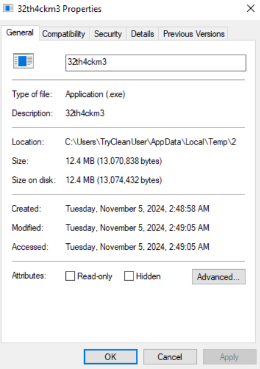
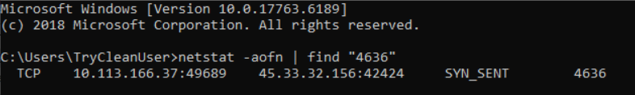
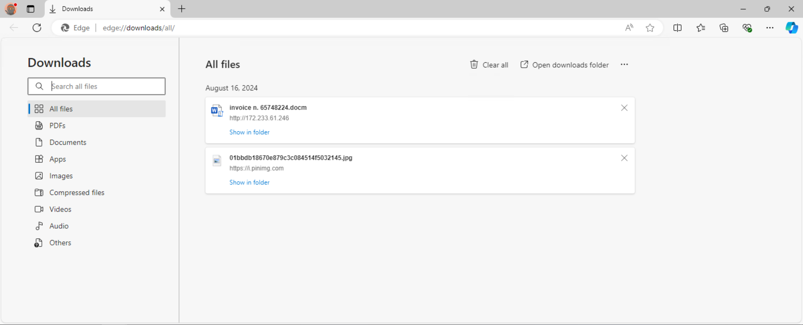
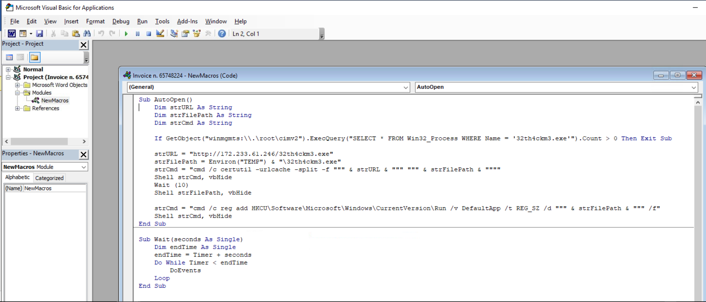
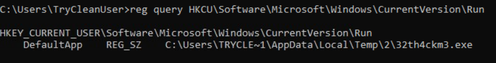
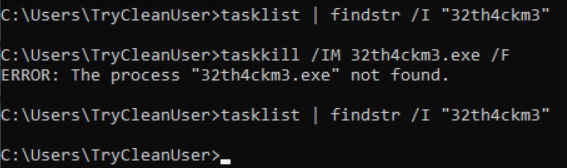
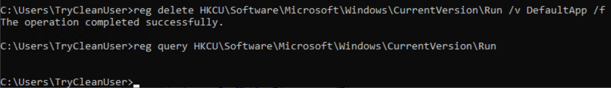
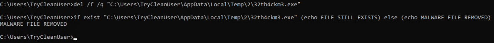
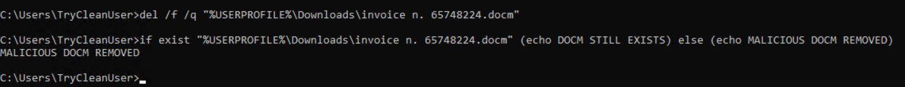

# 07 - Incident Response Journal

| Information           | Details                                   |
| --------------------- | ----------------------------------------- |
| Difficulty            | Beginner                                  |
| Category              | Incident Response & Malware Investigation |
| Platform              | TryHackMe                                 |
| Practice Room         | Incident Response Process                 |
| Related Google Module | Sound the Alarm: Detection and Response   |

---

## Overview

In this lab, I worked through a basic incident response scenario on a compromised Windows workstation.

I started with a performance problem reported by the user, identified a suspicious process, checked its network activity, investigated the likely infection vector, reviewed a malicious VBA macro, and then removed the persistence mechanism and malicious files from the system.

The main goal was to follow the incident from **detection and analysis** through **containment, eradication, and recovery**.

---

## Learning Goal

My goal was to practice a complete incident response workflow instead of investigating only one log or alert.

I wanted to understand how different pieces of evidence can be connected together and how the findings from an investigation affect the remediation steps that follow.

---

## What I Practiced

* Reviewing suspicious running processes
* Checking executable properties and file locations
* Identifying a process ID
* Reviewing outbound connections with `netstat`
* Investigating browser download history
* Inspecting a macro-enabled Word document
* Reviewing VBA code without executing it manually
* Identifying a malicious download command
* Identifying Registry Run key persistence
* Terminating a suspicious process
* Removing a persistence entry
* Deleting malicious files
* Keeping track of IoCs during an incident investigation

---

## Google Cybersecurity Connection

This lab connects to the incident detection and response concepts I studied in the Google Cybersecurity Certificate.

The course introduced incident investigation, documentation, containment, recovery, and the importance of collecting evidence before remediation.

In this lab, I applied those ideas to a Windows workstation and followed the incident through several response phases.

---

# Detection and Analysis

## Suspicious Process

I started by reviewing Task Manager because the workstation had unusually high CPU usage.

A process named `32th4ckm3.exe` was using around half of the available CPU resources.

When I reviewed its properties, I found that it was running from:

```text
C:\Users\TryCleanUser\AppData\Local\Temp\2
```

A randomly named executable running from a temporary user directory and consuming a large amount of CPU was enough for me to investigate it further.



---

## Network Activity

I identified the PID of the suspicious process and used `netstat` to check whether it was communicating over the network.

The process attempted an outbound connection to:

```text
45.33.32.156:42424
```

The connection state was:

```text
SYN_SENT
```

This showed an outbound connection attempt from the suspicious process. I did not treat this as proof that a complete connection to a C2 server was successfully established.



---

# Infection Vector Investigation

## Suspicious Download

I reviewed the Edge download history and found a macro-enabled Word document:

```text
invoice n. 65748224.docm
```

It had been downloaded directly from:

```text
http://172.233.61.246
```

The `.docm` extension and the IP-based download source made the document worth investigating.



---

## VBA Macro Analysis

I opened the document and reviewed its VBA macro in the editor.

The macro used an `AutoOpen()` function, meaning its code could run automatically when the document was opened.

The code referenced the same suspicious executable seen earlier:

```text
32th4ckm3.exe
```

It also contained this download location:

```text
http://172.233.61.246/32th4ckm3.exe
```

The macro used `certutil` to download the executable into the user's temporary directory and then launch it.

I also found a command that added the executable to the current user's Windows `Run` registry key.



---

# Persistence Analysis

I checked:

```text
HKCU\Software\Microsoft\Windows\CurrentVersion\Run
```

and confirmed that a value named `DefaultApp` referenced the suspicious executable:

```text
C:\Users\TryCleanUser\AppData\Local\Temp\2\32th4ckm3.exe
```

This provided system-level evidence that the malware had configured itself to start again when the user logged in.



---

# Indicators of Compromise

During the investigation I collected the following IoCs:

| Type                      | Indicator                                                  |
| ------------------------- | ---------------------------------------------------------- |
| Process                   | `32th4ckm3.exe`                                            |
| Malware Path              | `C:\Users\TryCleanUser\AppData\Local\Temp\2\32th4ckm3.exe` |
| Suspicious Remote Address | `45.33.32.156:42424`                                       |
| Malicious Document        | `invoice n. 65748224.docm`                                 |
| Document Source           | `http://172.233.61.246`                                    |
| Malware URL               | `http://172.233.61.246/32th4ckm3.exe`                      |
| Persistence Key           | `HKCU\Software\Microsoft\Windows\CurrentVersion\Run`       |
| Persistence Value         | `DefaultApp`                                               |

---

# Containment

## Process Termination

After collecting the necessary information, I stopped the suspicious process.

I then used `tasklist` to verify that `32th4ckm3.exe` was no longer running.



---

# Eradication and Recovery

## Removing Registry Persistence

I removed the malicious `DefaultApp` value from the Windows `Run` key.

I queried the registry again afterward and confirmed that the persistence entry was no longer present.



---

## Removing the Malware

I deleted `32th4ckm3.exe` from the temporary directory and verified that the file no longer existed.



---

## Removing the Malicious Document

I also removed the original macro-enabled Word document from the Downloads directory.

I verified the deletion after closing the application that was still using the file.



---

# Incident Timeline

| Stage            | Finding                                                   |
| ---------------- | --------------------------------------------------------- |
| Detection        | Workstation showed unusually high CPU usage               |
| Process Review   | `32th4ckm3.exe` was consuming around 50% CPU              |
| File Review      | Executable was running from a temporary user directory    |
| Network Review   | Process attempted a connection to `45.33.32.156:42424`    |
| Infection Vector | `invoice n. 65748224.docm` was found in browser downloads |
| Macro Analysis   | `AutoOpen()` downloaded and launched `32th4ckm3.exe`      |
| Persistence      | Malware was added to the user's Registry Run key          |
| Containment      | Suspicious process was stopped                            |
| Eradication      | Registry persistence and malware executable were removed  |
| Recovery         | Malicious DOCM and browser download history were removed  |

---

# Result

## What I Learned

This lab helped me understand how an incident can be reconstructed by combining information from several different places instead of relying on one alert.

The suspicious process led me to network activity, the browser history led me to the original document, and the VBA macro explained both the malware download and the persistence mechanism.

---

## What I Found Most Useful

The most useful part was connecting the different artefacts together.

Instead of simply seeing a strange process and deleting it, I was able to understand:

```text
DOCM download
→ AutoOpen macro
→ certutil download
→ 32th4ckm3.exe
→ outbound connection attempt
→ Registry Run persistence
```

This also showed me why evidence should be collected before remediation.

---

## Response Summary

I identified and documented the suspicious process, outbound connection attempt, infection vector, malicious macro, and persistence mechanism.

After collecting the relevant IoCs, I terminated the suspicious process, removed the Registry Run persistence entry, deleted the executable, and removed the malicious Word document.

The affected artefacts identified during this investigation were removed from the workstation.

---

## Next Step

The next lab will focus on threat intelligence and IOC analysis, using indicators from security events to support investigation and detection.
