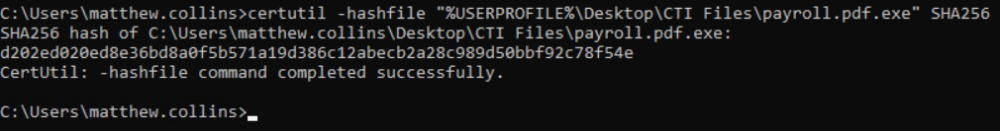
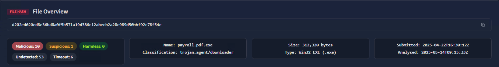
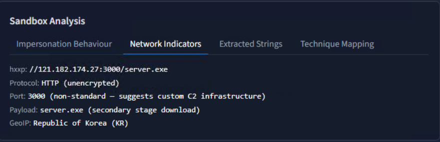
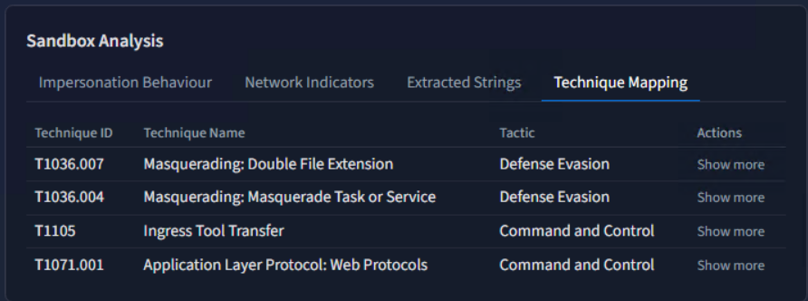
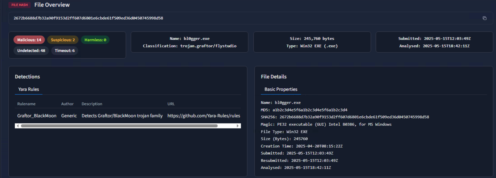
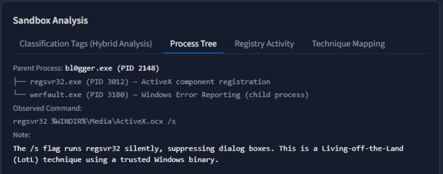
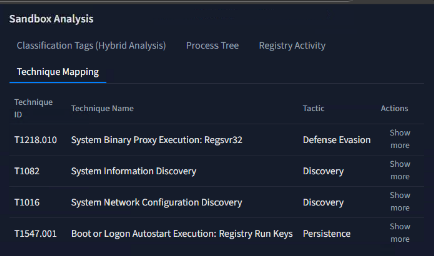

# 08 - Threat Intelligence & IOC Analysis

| Information | Details |
|---|---|
| Difficulty | Beginner |
| Category | Threat Intelligence & Malware Analysis |
| Platform | TryHackMe |
| Practice Room | File and Hash Threat Intel |
| Analysis Tool | TryDetectThis |

---

## Overview

In this lab, I practiced analysing suspicious Windows executable files by using cryptographic hashes, threat intelligence reports, sandbox findings, network indicators, and MITRE ATT&CK mappings.

Instead of deciding whether a file was malicious only from its name, I first generated SHA-256 hashes locally and then searched those indicators in TryDetectThis.

I investigated two different samples:

- `payroll.pdf.exe`
- `bl0gger.exe`

The investigation included:

- SHA-256 generation
- file reputation and classification
- detection results
- network IOC identification
- secondary payload identification
- sandbox process analysis
- Living-off-the-Land behaviour
- MITRE ATT&CK technique mapping

---

## Learning Goal

My goal was to understand how a basic file indicator can become the starting point for a larger threat intelligence investigation.

I wanted to practice moving from:

`file → hash → threat intelligence → related IOC → behaviour → ATT&CK technique`

I also focused on separating information directly observed in the report from conclusions that would require additional evidence.

---

## Google Cybersecurity Connection

This lab connects to threat identification and investigation concepts I studied while working through the Google Cybersecurity Certificate.

The Google coursework introduced the importance of indicators, malware analysis, detection evidence, and using multiple sources of information during an investigation.

In this lab, I applied those ideas by generating file hashes myself and then enriching those hashes with threat intelligence and sandbox data.

---

# Sample 1 - payroll.pdf.exe

## Initial File Review

The first suspicious file was:

`payroll.pdf.exe`

The filename immediately stood out because it used a double extension.

Although the name contains `.pdf`, the actual file extension is `.exe`.

This can make an executable appear similar to a normal payroll document, especially when Windows file extensions are hidden.

I treated the filename as an initial heuristic indicator, but not as enough evidence by itself to classify the file as malicious.

---

## SHA-256 Generation

I generated a SHA-256 hash locally with:

```cmd
certutil -hashfile "%USERPROFILE%\Desktop\CTI Files\payroll.pdf.exe" SHA256
```

The resulting SHA-256 value was:

```text
d202ed020ed8e36bd8a0f5b571a19d386c12abecb2a28c989d50bbf92c78f54e
```

This gave me a stable IOC that could be searched without executing the file.



---

## Threat Intelligence Lookup

I searched the SHA-256 hash in TryDetectThis.

The report identified the file as:

```text
payroll.pdf.exe
```

and classified it as:

```text
trojan.agent/downloader
```

The overview showed:

- Malicious detections: `10`
- Suspicious detections: `1`
- Harmless detections: `0`
- File type: `Win32 EXE`
- File size: `312,320 bytes`

The report also included an IDS rule associated with Trojan downloader HTTP activity.

This provided stronger evidence than the filename alone.



---

## Network IOC Analysis

The sandbox report identified network activity related to:

```text
121.182.174.27
```

using:

```text
TCP/3000
```

The related URL was presented in defanged format as:

```text
hxxp://121.182.174.27:3000/server.exe
```

The report described:

```text
server.exe
```

as a secondary-stage download.

Other information shown in the report included:

- Protocol: HTTP
- Encryption: none
- Port: `3000`
- GeoIP: Republic of Korea (KR)

This was an important pivot because the investigation moved from a file-based IOC to a network IOC and another executable.



---

## IOC Pivot Attempt

After identifying:

```text
121.182.174.27
```

I attempted to search the IP address separately in TryDetectThis.

The platform returned:

```text
No Results Found
```

and explained that it is a static analysis platform where only pre-loaded indicators have reports available.

Because of this limitation, I did not treat the missing IP report as evidence that the IP was safe.

The IP remained relevant because it was directly associated with the analysed malware sample's sandbox network activity.

I did not include a screenshot of the failed lookup because it did not add useful technical evidence to the repository.

---

## MITRE ATT&CK Mapping

The sandbox report mapped `payroll.pdf.exe` to several MITRE ATT&CK techniques.

| Technique ID | Technique | Tactic |
|---|---|---|
| `T1036.007` | Masquerading: Double File Extension | Defense Evasion |
| `T1036.004` | Masquerading: Masquerade Task or Service | Defense Evasion |
| `T1105` | Ingress Tool Transfer | Command and Control |
| `T1071.001` | Application Layer Protocol: Web Protocols | Command and Control |

The `T1036.007` mapping was especially relevant because it directly matched the observed filename:

```text
payroll.pdf.exe
```

The `T1105` and `T1071.001` mappings were also consistent with the HTTP-based secondary payload information shown in the sandbox report.



---

# Sample 2 - bl0gger.exe

## Initial Review

The second executable was:

```text
bl0gger.exe
```

I did not classify the file based only on its name.

Instead, I repeated the same hash-based investigation process used for the first sample.

---

## SHA-256 Generation

I generated its SHA-256 hash with:

```cmd
certutil -hashfile "%USERPROFILE%\Desktop\CTI Files\bl0gger.exe" SHA256
```

The result was:

```text
2672b6688d7b32a90f9153d2ff607d6801e6cbde61f509ed36d0450745998d58
```

I then searched this value in TryDetectThis.

I did not include another hash-generation screenshot because the same technical skill was already demonstrated with the first sample.

---

## Threat Intelligence Lookup

TryDetectThis identified the file as:

```text
bl0gger.exe
```

and classified it as:

```text
trojan.graftor/flystudio
```

The report showed:

- Malicious detections: `14`
- Suspicious detections: `2`
- Harmless detections: `0`
- File type: `Win32 EXE`
- File size: `245,760 bytes`

A YARA rule also matched:

```text
Graftor_BlackMoon
```

The report associated the sample with Graftor / BlackMoon-related malware activity.



---

## Sandbox Process Analysis

I reviewed the sandbox process tree to understand what the executable did during execution.

The parent process was:

```text
bl0gger.exe
```

The report showed child processes including:

```text
regsvr32.exe
werfault.exe
```

One observed command was:

```cmd
regsvr32 %WINDIR%\Media\ActiveX.ocx /s
```

The `/s` parameter runs `regsvr32` silently.

`regsvr32.exe` is a legitimate Windows binary, but legitimate system binaries can also be abused during malicious activity.

The sandbox report specifically highlighted this behaviour as a Living-off-the-Land technique.

This made the process tree more useful than simply relying on antivirus detections.



---

## Registry Activity Review

I also reviewed the Registry Activity section of the sandbox report.

The displayed registry activity did not provide enough additional value for a separate repository screenshot.

Because the repository is intended to show meaningful investigation evidence rather than every screen visited during the lab, I did not include that screen.

---

## MITRE ATT&CK Mapping

The sandbox report mapped `bl0gger.exe` to the following techniques:

| Technique ID | Technique | Tactic |
|---|---|---|
| `T1218.010` | System Binary Proxy Execution: Regsvr32 | Defense Evasion |
| `T1082` | System Information Discovery | Discovery |
| `T1016` | System Network Configuration Discovery | Discovery |
| `T1547.001` | Boot or Logon Autostart Execution: Registry Run Keys / Startup Folder | Persistence |

The most directly supported technique from my reviewed evidence was:

```text
T1218.010 - System Binary Proxy Execution: Regsvr32
```

because the sandbox process tree showed `regsvr32.exe` being launched by the suspicious sample.

The threat intelligence platform also mapped the malware to:

```text
T1547.001 - Registry Run Keys / Startup Folder
```

However, I did not independently verify a specific malicious Registry Run value during this lab.

For that reason, I recorded it as a sandbox threat intelligence finding rather than claiming that I personally confirmed the persistence key.



---

# IOC Summary

## File Indicators

| Indicator Type | Value |
|---|---|
| Filename | `payroll.pdf.exe` |
| SHA-256 | `d202ed020ed8e36bd8a0f5b571a19d386c12abecb2a28c989d50bbf92c78f54e` |
| Classification | `trojan.agent/downloader` |
| Filename | `bl0gger.exe` |
| SHA-256 | `2672b6688d7b32a90f9153d2ff607d6801e6cbde61f509ed36d0450745998d58` |
| Classification | `trojan.graftor/flystudio` |
| YARA Match | `Graftor_BlackMoon` |

## Network Indicators

| Indicator Type | Value |
|---|---|
| IP Address | `121.182.174.27` |
| Port | `3000` |
| Protocol | `HTTP` |
| URL | `hxxp://121.182.174.27:3000/server.exe` |
| Secondary Payload | `server.exe` |

---

# Investigation Flow

## payroll.pdf.exe

```text
Suspicious double-extension filename
              ↓
       SHA-256 generation
              ↓
   Threat intelligence lookup
              ↓
 Trojan/downloader classification
              ↓
       Network indicator
              ↓
     121.182.174.27:3000
              ↓
  Secondary payload: server.exe
              ↓
     MITRE ATT&CK mapping
```

## bl0gger.exe

```text
        bl0gger.exe
             ↓
      SHA-256 generation
             ↓
  Threat intelligence lookup
             ↓
Graftor/FlyStudio classification
             ↓
      Sandbox process tree
             ↓
       regsvr32.exe usage
             ↓
 Living-off-the-Land behaviour
             ↓
     MITRE ATT&CK mapping
```

---

# Evidence Collected

The screenshots included in this lab are:

```text
screenshots/
├── 01-payroll-sha256-hash.png
├── 02-payroll-threat-intel-overview.png
├── 03-secondary-payload-network-ioc.png
├── 04-mitre-attack-mapping.png
├── 05-bl0gger-threat-intel-overview.png
├── 06-bl0gger-process-tree-lolbin.png
└── 07-bl0gger-mitre-attack-mapping.png
```

I intentionally did not include every page viewed during the investigation.

Screenshots were selected only when they demonstrated a new technical finding or investigation step.

---

# What I Practiced

During this lab, I practiced:

- reviewing suspicious filenames
- identifying double-extension masquerading
- generating SHA-256 hashes with `certutil`
- using hashes as Indicators of Compromise
- performing threat intelligence lookups
- reviewing malware classifications
- reviewing detection counts
- identifying YARA rule matches
- analysing sandbox network indicators
- identifying secondary-stage payloads
- pivoting from a file IOC to a network IOC
- reviewing sandbox process trees
- recognising suspicious use of legitimate Windows binaries
- understanding Living-off-the-Land behaviour
- reviewing MITRE ATT&CK technique mappings
- distinguishing platform-generated findings from independently verified evidence

---

# Key Takeaways

## 1. A filename is only an initial clue

The name `payroll.pdf.exe` was suspicious because of its double extension, but I did not rely on the filename alone.

The SHA-256 lookup and sandbox findings provided stronger technical evidence.

## 2. Hashes are useful pivot points

A file hash allowed me to move from a local file to:

- malware classification
- related network indicators
- another executable
- sandbox behaviour
- ATT&CK techniques

## 3. Threat intelligence can connect different IOC types

The first investigation started with a file hash and eventually produced:

```text
SHA-256
→ malware classification
→ IP address
→ port
→ URL
→ secondary executable
```

## 4. Behaviour matters

The `bl0gger.exe` report showed why process behaviour is useful.

Instead of only seeing that antivirus vendors classified the file as malicious, I could see:

```text
bl0gger.exe
→ regsvr32.exe
```

and relate that behaviour to ATT&CK technique `T1218.010`.

## 5. Platform results and personal verification are different

Some ATT&CK techniques were provided directly by the sandbox platform.

I kept those findings in the analysis, but I did not claim that I independently verified every mapped behaviour.

This was especially important for the Registry Run Keys persistence mapping.

---

# Result

I analysed two suspicious Windows executable samples using SHA-256 hashes and threat intelligence data.

For `payroll.pdf.exe`, I identified:

- a Trojan/downloader classification
- double-extension masquerading
- a related network IOC
- HTTP communication over port `3000`
- a secondary payload named `server.exe`
- multiple MITRE ATT&CK mappings

For `bl0gger.exe`, I identified:

- a Graftor/FlyStudio Trojan classification
- a `Graftor_BlackMoon` YARA match
- suspicious sandbox process behaviour
- use of `regsvr32.exe`
- Living-off-the-Land behaviour
- multiple MITRE ATT&CK mappings

This lab helped me understand how threat intelligence can enrich a simple file indicator and how static indicators, network information, sandbox behaviour, and ATT&CK mappings can be combined during an investigation.

---

## Next Step

The next portfolio lab will focus on Windows Event Log analysis and investigating suspicious activity through Windows event data.
