# 09 - Windows Event Log Analysis

| Information | Details |
|---|---|
| Difficulty | Beginner |
| Category | SOC Analysis & Windows Logging |
| Platform | TryHackMe |
| Practice Room | Windows Logging for SOC |
| Main Tools | Event Viewer, Sysmon, PowerShell History |

---

## Overview

In this lab, I practiced investigating Windows security activity using native Windows Security logs, Sysmon telemetry, and PowerShell command history.

The lab was divided into several small investigation scenarios rather than one single incident.

I worked with:

- Windows Security Event Logs
- Sysmon Process Creation events
- Sysmon File Creation events
- Sysmon DNS events
- Sysmon Network Connection events
- PowerShell PSReadLine history

The main goal was to understand how different Windows telemetry sources can be used during SOC investigations.

---

## Learning Goal

My goal was to practice moving beyond simply recognising Event IDs.

I wanted to understand how to:

- identify failed and successful logons
- correlate events using Logon IDs
- investigate suspicious user creation
- review local group membership changes
- reconstruct process relationships
- identify persistence-related file activity
- extract network indicators
- review PowerShell command history

---

## Google Cybersecurity Connection

This lab connects to the detection and incident investigation concepts I studied in the Google Cybersecurity Certificate.

The Google coursework introduced the importance of log analysis, event correlation, identifying indicators, and reconstructing activity from multiple evidence sources.

In this lab, I applied those concepts directly to Windows Security logs, Sysmon telemetry, and PowerShell history.

---

# Investigation 1 - Failed Logons and RDP Compromise

## Failed Logon Analysis

I opened:

```text
Practice-Security.evtx
```

and filtered the Security log for:

```text
Event ID 4625
```

Event ID `4625` represents a failed logon attempt.

The filtered dataset contained multiple failed logon events originating from the same source:

```text
Source Network Address: 10.10.53.248
Workstation Name: b1465f
```

The repeated failed authentication events from the same source were consistent with brute-force activity against `THM-PC`.

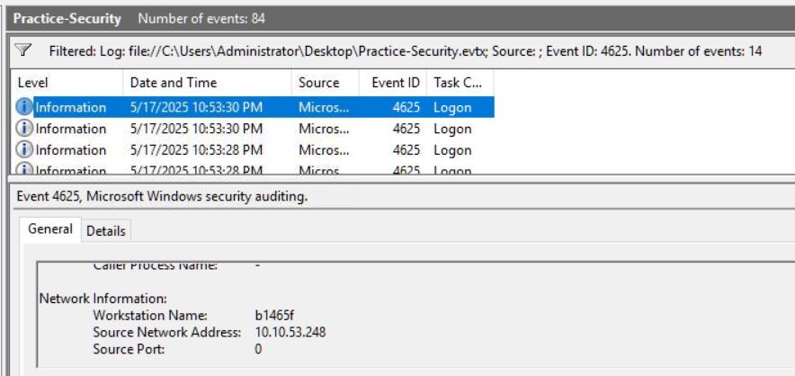

---

## Successful RDP Logon

I then filtered the same Security log for:

```text
Event ID 4624
```

Event ID `4624` represents a successful logon.

I reviewed the events until I found a successful logon with:

```text
Logon Type: 10
```

Logon Type `10` represents a Remote Desktop / RemoteInteractive logon.

The event showed:

```text
TargetUserName: Administrator
TargetLogonId: 0x183c36d
LogonType: 10
```

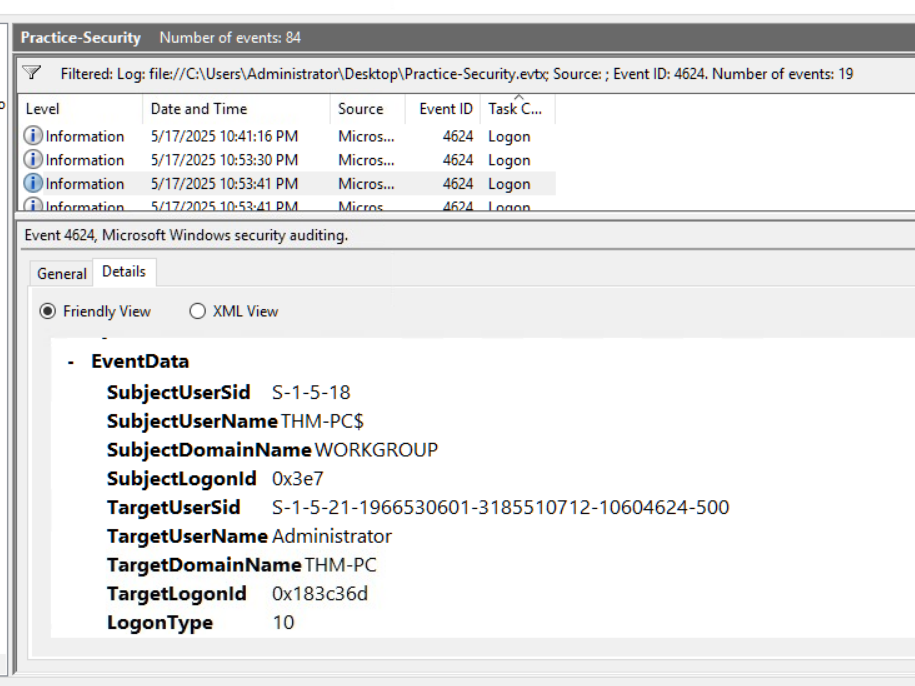

The same event also showed:

```text
IpAddress: 10.10.53.248
```

This matched the source IP observed in the preceding failed authentication activity.

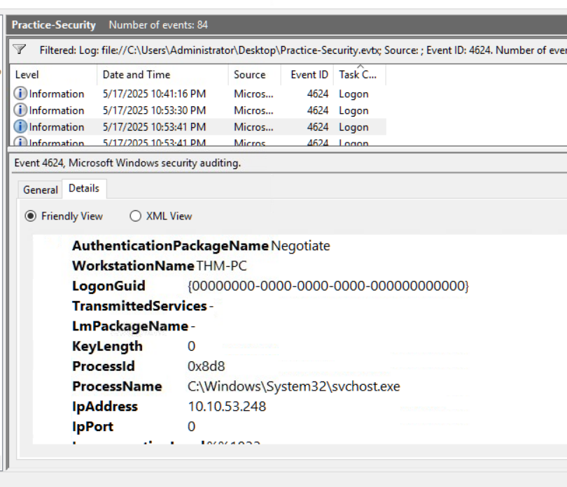

---

## Correlated Findings

The Security logs allowed me to connect:

```text
Repeated Event ID 4625 failures
        ↓
Source IP: 10.10.53.248
        ↓
Successful Event ID 4624
        ↓
Logon Type 10
        ↓
Administrator
        ↓
Logon ID: 0x183c36d
```

This demonstrated why the Logon ID is useful during Windows investigations.

Instead of treating each event separately, I could use the session identifier to correlate later activity with the compromised RDP session.

---

# Investigation 2 - Backdoor User Creation

## Event ID 4720

I filtered the Security log for:

```text
4720,4732
```

Event ID `4720` records the creation of a new user account.

One event showed the creation of:

```text
svc_sysrestore
```

The important fields were:

```text
TargetUserName: svc_sysrestore
SubjectUserName: Administrator
SubjectLogonId: 0x183c36d
```

The `SubjectLogonId` matched the Logon ID from the suspicious Administrator RDP session.

This directly connected the account creation to the previously identified session.

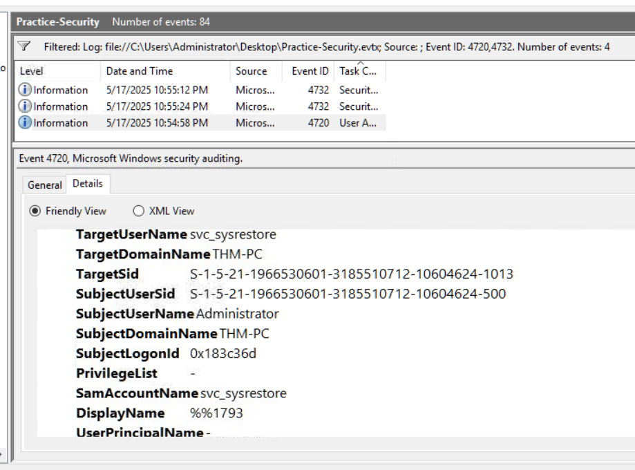

---

## Remote Desktop Users Membership

I then reviewed Event ID `4732` events.

Event ID `4732` records a member being added to a local security group.

The SID associated with the newly created account was:

```text
S-1-5-21-1966530601-3185510712-10604624-1013
```

One Event ID `4732` showed this SID being added to:

```text
Remote Desktop Users
```

This would allow the account to be used for Remote Desktop access.

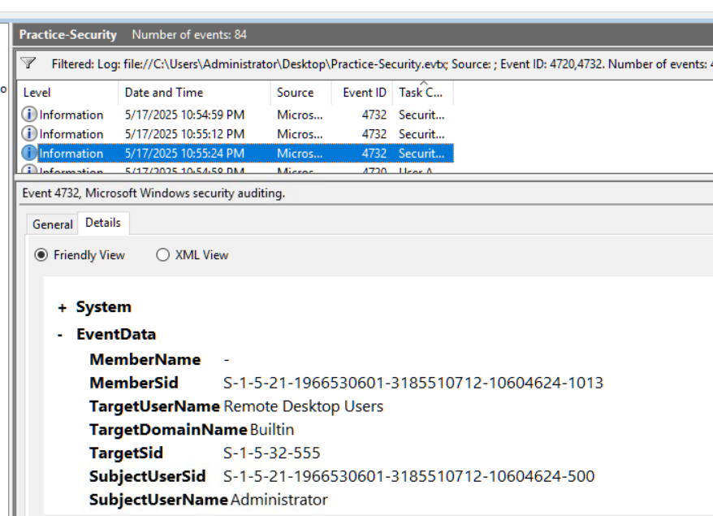

---

## Backup Operators Membership

Another Event ID `4732` showed the same account SID being added to:

```text
Backup Operators
```

This group can provide powerful backup and restore-related privileges.

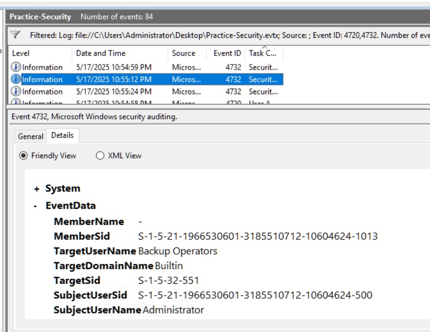

---

## Account Activity Summary

The Security log investigation produced the following sequence:

```text
Administrator RDP session
        ↓
Logon ID: 0x183c36d
        ↓
svc_sysrestore created
        ↓
Added to Remote Desktop Users
        ↓
Added to Backup Operators
```

The matching Logon ID was the key evidence connecting the account creation to the suspicious session.

---

# Investigation 3 - Sysmon Process Analysis

## Practice-Sysmon.evtx

For the Sysmon section, I opened:

```text
Practice-Sysmon.evtx
```

and filtered for:

```text
Event ID 1
```

Sysmon Event ID `1` records process creation.

---

## Suspicious Executable

I identified the following process:

```text
C:\Users\sarah.miller\Downloads\ckjg.exe
```

Important fields included:

```text
ProcessId: 1460
Image: C:\Users\sarah.miller\Downloads\ckjg.exe
CommandLine: "C:\Users\sarah.miller\Downloads\ckjg.exe"
CurrentDirectory: C:\Users\sarah.miller\Downloads\
User: THM-PC\sarah.miller
LogonId: 0x1f98906
```

The location and randomly named executable made the process worth further investigation.

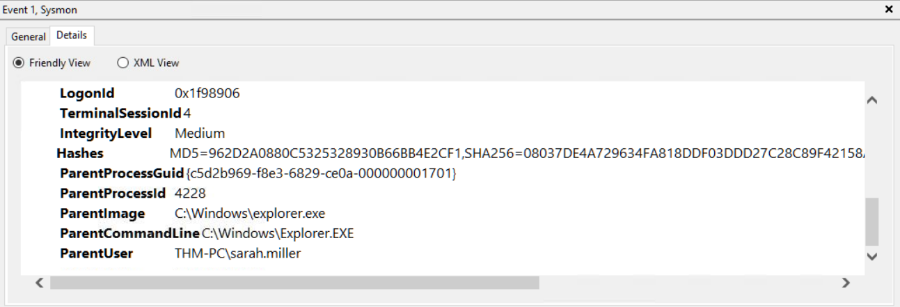

---

## Parent Process

The same process creation event showed:

```text
ParentProcessId: 4228
ParentImage: C:\Windows\explorer.exe
ParentCommandLine: C:\Windows\Explorer.EXE
ParentUser: THM-PC\sarah.miller
```

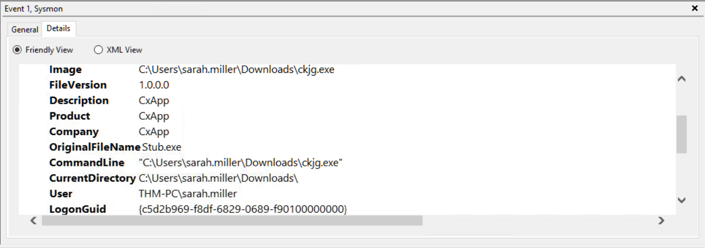

The parent process itself was not inherently suspicious.

The investigation therefore focused on the behaviour performed by `ckjg.exe` after execution.

---

## Discovery Behaviour

During the investigation, I also observed `ckjg.exe` launching Windows Management Instrumentation Command-line:

```text
C:\Windows\System32\wbem\WMIC.exe
```

with:

```cmd
wmic computersystem get domain
```

This command queries domain information from the system.

The parent process information linked this WMIC activity back to:

```text
ckjg.exe
```

This was useful for understanding what the suspicious executable attempted to discover after launch.

---

# Investigation 4 - Sysmon File and Network Activity

## Startup Folder File Creation

I reviewed other Sysmon events associated with:

```text
ProcessId: 1460
```

A Sysmon Event ID `11` recorded file creation by `ckjg.exe`.

The created file was:

```text
C:\Users\sarah.miller\AppData\Roaming\Microsoft\Windows\Start Menu\Programs\Startup\DeleteApp.url
```

Important fields included:

```text
Event ID: 11
ProcessId: 1460
Image: C:\Users\sarah.miller\Downloads\ckjg.exe
TargetFilename: ...\Startup\DeleteApp.url
```

Because the file was created inside the user's Windows Startup directory, this activity indicated a persistence mechanism.

I did not independently inspect the contents of `DeleteApp.url`, so I did not make assumptions about exactly what the shortcut launched.

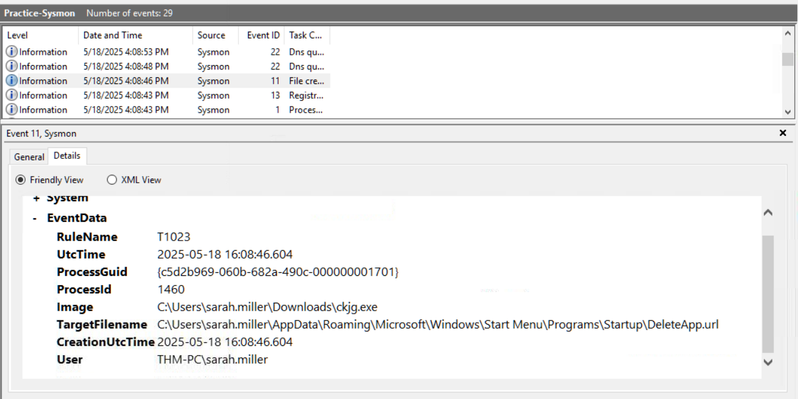

---

## Suspicious DNS Query

A Sysmon Event ID `22` recorded a DNS query from the same process:

```text
ProcessId: 1460
Image: C:\Users\sarah.miller\Downloads\ckjg.exe
```

The queried domain was:

```text
fshjaifhajfa.click
```

The event showed:

```text
QueryStatus: 9003
QueryResults: -
```

The query therefore did not successfully resolve.

However, the random-looking `.click` domain was still useful as an observed network indicator associated with the suspicious executable.

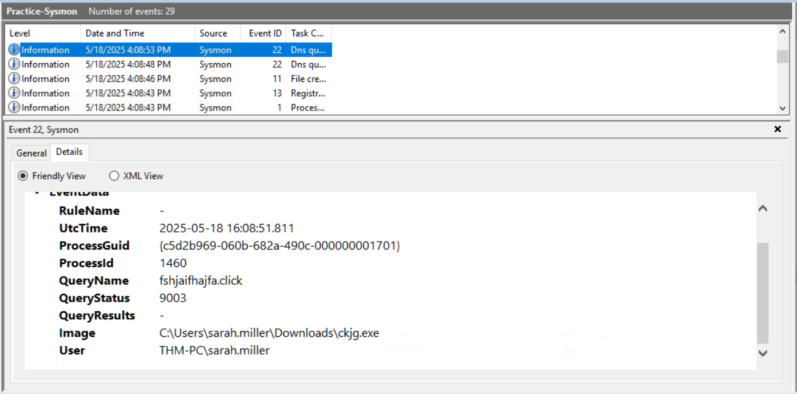

---

## Outbound Network Connection

A Sysmon Event ID `3` showed the same executable initiating a TCP connection.

The source process was:

```text
ProcessId: 1460
Image: C:\Users\sarah.miller\Downloads\ckjg.exe
User: THM-PC\sarah.miller
Protocol: tcp
Initiated: true
```

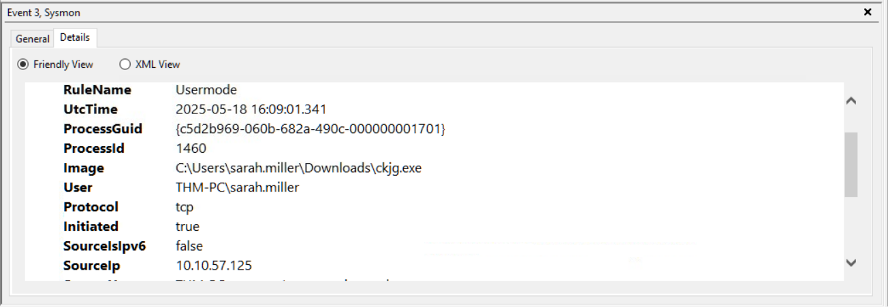

The destination information was:

```text
DestinationIp: 193.46.217.4
DestinationPort: 7777
```

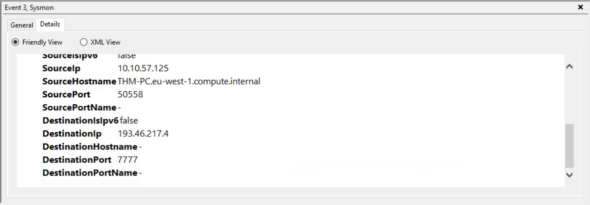

Because port `7777` is a non-standard port and the connection was initiated by the suspicious executable, I treated the activity as suspicious outbound communication.

I did not independently verify the remote infrastructure, so I did not label the connection as confirmed C2.

---

## Sysmon Investigation Flow

The Sysmon investigation produced this behavioural chain:

```text
explorer.exe
    ↓
ckjg.exe
    ↓
System/domain discovery
    ↓
Startup folder file creation
    ↓
DNS query
    ↓
Outbound TCP connection
```

Observed indicators included:

```text
File:
C:\Users\sarah.miller\Downloads\ckjg.exe

Persistence-related file:
DeleteApp.url

DNS:
fshjaifhajfa.click

Destination:
193.46.217.4:7777
```

---

# Investigation 5 - PowerShell History

## PSReadLine History

The final investigation focused on PowerShell command history.

I reviewed:

```text
%APPDATA%\Microsoft\Windows\PowerShell\PSReadLine\ConsoleHost_history.txt
```

PowerShell history is useful because many commands can execute inside a single `powershell.exe` process and may not create a separate process creation event for every action.

---

## Filtered PowerShell Activity

I filtered the history for commands related to Terminal Services, registry changes, and system hive access.

The resulting commands included:

```powershell
Set-Service -Name "TermService" -StartupType Disabled
Set-ItemProperty -Path 'HKLM:\System\CurrentControlSet\Control\Terminal Server' -Name "fDenyTSConnections" -Value 1
reg save HKLM\SYSTEM C:\Windows\Temp\system.bak /y
Remove-Item C:\Windows\Temp\system.bak -Force
Get-Service TermService | Select-Object Name, Status, StartType
Get-ItemProperty "HKLM:\SYSTEM\CurrentControlSet\Services\TermService" | Select-Object Start
Stop-Service -Name "TermService" -Force
```

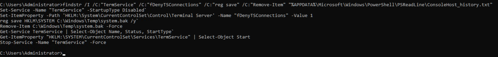

---

## PowerShell Findings

The commands showed activity capable of:

- changing the startup state of Remote Desktop Services
- changing the `fDenyTSConnections` registry setting
- saving the SYSTEM registry hive to a temporary file
- deleting the temporary hive copy
- querying the Terminal Services configuration
- stopping the Terminal Services service

These commands have significant administrative impact.

Because the history file records commands but not their outputs or full surrounding context, I documented them as suspicious or security-relevant activity rather than automatically treating every command as malicious.

---

# Key Event IDs Used

| Event ID | Source | Meaning |
|---|---|---|
| `4625` | Windows Security | Failed logon |
| `4624` | Windows Security | Successful logon |
| `4720` | Windows Security | User account created |
| `4732` | Windows Security | Member added to local security group |
| `1` | Sysmon | Process creation |
| `3` | Sysmon | Network connection |
| `11` | Sysmon | File creation |
| `13` | Sysmon | Registry value set |
| `22` | Sysmon | DNS query |

---

# Indicators and Artefacts

| Type | Value |
|---|---|
| Brute-force source IP | `10.10.53.248` |
| Compromised account | `Administrator` |
| Suspicious RDP Logon ID | `0x183c36d` |
| Created account | `svc_sysrestore` |
| Backdoor account SID | `S-1-5-21-1966530601-3185510712-10604624-1013` |
| Added group | `Remote Desktop Users` |
| Added group | `Backup Operators` |
| Suspicious executable | `C:\Users\sarah.miller\Downloads\ckjg.exe` |
| Suspicious process PID | `1460` |
| Sysmon Logon ID | `0x1f98906` |
| Startup artefact | `DeleteApp.url` |
| DNS indicator | `fshjaifhajfa.click` |
| Destination IP | `193.46.217.4` |
| Destination port | `7777/TCP` |

---

# Evidence Collected

```text
screenshots/
├── 01-bruteforce-source-ip.png
├── 02-1-malicious-rdp-session-details.png
├── 02-2-malicious-rdp-source-ip.png
├── 03-backdoor-user-created.png
├── 04-1-backdoor-added-to-rdp-users.png
├── 04-2-backdoor-added-to-backup-operators.png
├── 05-1-suspicious-ckjg-process.png
├── 05-2-ckjg-parent-process.png
├── 06-startup-persistence-file-created.png
├── 07-suspicious-dns-query.png
├── 08-1-ckjg-outbound-connection.png
├── 08-2-ckjg-destination-ip-port.png
└── 09-powershell-history-suspicious-commands.png
```

I did not include screenshots that only repeated information or did not provide a new technical finding.

---

# What I Practiced

During this lab, I practiced:

- filtering Windows logs by Event ID
- analysing failed authentication activity
- distinguishing Logon Type 3 and Logon Type 10
- identifying RDP sessions
- correlating activity using Logon IDs
- identifying suspicious account creation
- reviewing local security group membership changes
- analysing Sysmon process creation
- tracing parent and child processes
- reviewing process command lines
- investigating suspicious file creation
- identifying Startup folder persistence
- analysing DNS queries
- analysing outbound network connections
- extracting network indicators
- reviewing PowerShell PSReadLine history
- separating observed evidence from assumptions

---

# Key Takeaways

## 1. Event IDs are only the starting point

Knowing that `4625` means failed logon or that Sysmon Event ID `1` means process creation is useful, but the real investigation starts when the fields inside those events are correlated.

---

## 2. Logon IDs are valuable correlation fields

The Logon ID:

```text
0x183c36d
```

connected the suspicious RDP session to the later creation of `svc_sysrestore`.

This showed how session identifiers can help reconstruct attacker activity.

---

## 3. Parent-child relationships provide context

The suspicious process was not evaluated only by filename.

I reviewed:

```text
explorer.exe
    ↓
ckjg.exe
    ↓
WMIC.exe
```

to better understand how it was launched and what it did afterward.

---

## 4. One process can generate several types of telemetry

The same `ckjg.exe` process produced evidence across multiple Sysmon Event IDs:

```text
Event ID 1  → Process creation
Event ID 11 → File creation
Event ID 22 → DNS query
Event ID 3  → Network connection
```

This allowed the activity to be reconstructed from multiple telemetry sources.

---

## 5. Failed DNS activity can still be useful

The DNS query to:

```text
fshjaifhajfa.click
```

did not successfully resolve.

However, the query itself still showed that the suspicious process attempted to resolve that domain.

---

## 6. Suspicious does not automatically mean confirmed C2

The connection to:

```text
193.46.217.4:7777
```

was unusual and directly associated with the suspicious executable.

However, without additional threat intelligence or network evidence, I recorded it as suspicious outbound communication rather than confirmed command-and-control traffic.

---

## 7. PowerShell requires additional visibility

Process creation logs alone do not reveal every command entered into a PowerShell session.

Reviewing the PSReadLine history provided command-level visibility that Sysmon process creation alone could not provide.

---

# Result

This lab gave me practical experience investigating Windows systems using several different logging sources.

Using Windows Security logs, I identified repeated failed logons, correlated a successful RDP session, and linked the same Logon ID to the creation and configuration of a new user account.

Using Sysmon, I analysed a suspicious executable, reviewed its parent process, identified a Startup folder artefact, extracted a DNS indicator, and identified suspicious outbound network activity.

Finally, I reviewed PowerShell history to identify security-relevant commands that affected Terminal Services and the SYSTEM registry hive.

The most important lesson from this lab was that Windows investigations become much stronger when events are correlated instead of analysed in isolation.

---

## Next Step

The next portfolio lab will focus on cloud and identity security fundamentals.
