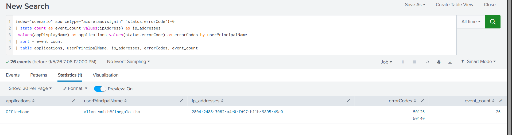
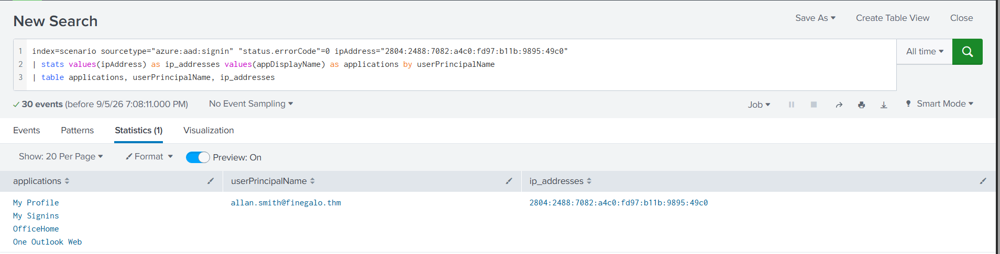
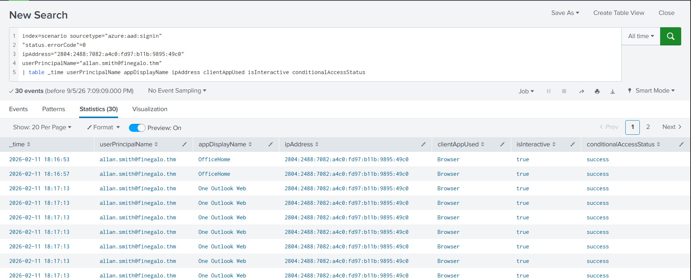

# 10 - Cloud Identity Basics

| Information | Details |
|---|---|
| Difficulty | Beginner |
| Category | Cloud Identity & Authentication Security |
| Platform | TryHackMe |
| Practice Room | M365 Monitoring Basics |
| Technologies | Microsoft Entra ID, Microsoft 365, Splunk |

---

## Overview

In this lab, I investigated suspicious Microsoft Entra ID authentication activity using sign-in logs collected in Splunk.

The scenario contained multiple failed authentication attempts followed by successful sign-ins from the same source IP.

I used Entra ID sign-in telemetry to identify:

- the targeted user
- the source IP
- failed authentication volume
- authentication error codes
- successful sign-ins
- accessed Microsoft 365 applications
- browser-based interactive sessions
- Conditional Access status

---

## Learning Goal

My goal was to practice basic cloud identity investigation and understand how authentication logs can be used to identify a possible account compromise.

Instead of looking only at individual login events, I correlated failed and successful authentication activity using:

```text
User
+
Source IP
+
Authentication result
+
Application
```

---

## Why Entra ID Logs Matter

Microsoft Entra ID sign-in logs record authentication attempts against cloud identities.

Useful fields include:

```text
userPrincipalName
ipAddress
appDisplayName
clientAppUsed
isInteractive
status.errorCode
conditionalAccessStatus
```

These fields can help SOC analysts identify brute-force activity, suspicious successful logins, unusual applications, and identity-related security events.

---

# Investigation 1 - Failed Authentication Attempts

I started by searching all failed Entra ID sign-in events.

```spl
index="scenario" sourcetype="azure:aad:signin" "status.errorCode"!=0
| stats count as event_count values(ipAddress) as ip_addresses
 values(appDisplayName) as applications values(status.errorCode) as errorCodes by userPrincipalName
| sort - event_count
| table applications, userPrincipalName, ip_addresses, errorCodes, event_count
```

The results identified:

```text
User:
allan.smith@finegalo.thm

Source IP:
2804:2488:7082:a4c0:fd97:b11b:9895:49c0

Application:
OfficeHome

Failed events:
26
```

The authentication activity also contained error codes:

```text
50126
50140
```

The repeated failures from the same source against the same identity made the activity worth further investigation.



---

# Investigation 2 - Successful Sign-ins From the Same IP

After identifying the suspicious source IP, I searched for successful sign-ins originating from the same address.

```spl
index=scenario sourcetype="azure:aad:signin"
"status.errorCode"=0
ipAddress="2804:2488:7082:a4c0:fd97:b11b:9895:49c0"
| stats values(ipAddress) as ip_addresses
 values(appDisplayName) as applications by userPrincipalName
| table applications, userPrincipalName, ip_addresses
```

Successful authentication activity was found for:

```text
allan.smith@finegalo.thm
```

from the same IPv6 address.

The source successfully accessed:

```text
My Profile
My Signins
OfficeHome
One Outlook Web
```

This connected the earlier failed authentication activity with later successful cloud access.



---

# Investigation 3 - Interactive Cloud Sessions

I then reviewed the successful authentication events in more detail.

```spl
index=scenario sourcetype="azure:aad:signin"
"status.errorCode"=0
ipAddress="2804:2488:7082:a4c0:fd97:b11b:9895:49c0"
userPrincipalName="allan.smith@finegalo.thm"
| table _time userPrincipalName appDisplayName ipAddress clientAppUsed isInteractive conditionalAccessStatus
```

The resulting events showed:

```text
User:
allan.smith@finegalo.thm

Client:
Browser

Interactive:
true

Conditional Access Status:
success
```

Applications included:

```text
OfficeHome
One Outlook Web
```



The events therefore showed successful interactive browser sessions from the same source IP that generated the earlier failed authentication attempts.

`conditionalAccessStatus=success` indicates that the Conditional Access evaluation succeeded for those sign-ins.

I did not interpret this field alone as proof that MFA was completed because the evidence reviewed in this lab did not independently confirm the MFA result.

---

# Investigation Flow

```text
26 failed authentication attempts
            ↓
Target identity identified
            ↓
allan.smith@finegalo.thm
            ↓
Source IPv6 identified
            ↓
2804:2488:7082:a4c0:fd97:b11b:9895:49c0
            ↓
Successful sign-ins from same IP
            ↓
OfficeHome / Outlook / account portals
            ↓
Interactive browser sessions
            ↓
Conditional Access status reviewed
```

---

# Identity Indicators

| Type | Value |
|---|---|
| User Principal Name | `allan.smith@finegalo.thm` |
| Source IPv6 | `2804:2488:7082:a4c0:fd97:b11b:9895:49c0` |
| Failed Sign-ins | `26` |
| Application | `OfficeHome` |
| Application | `One Outlook Web` |
| Client | `Browser` |
| Interactive Login | `true` |
| Conditional Access Status | `success` |

---

# What I Practiced

During this lab, I practiced:

- analysing Microsoft Entra ID sign-in logs
- using Splunk to investigate cloud authentication
- identifying repeated failed authentication attempts
- grouping events by user and source IP
- reviewing Entra ID authentication error codes
- pivoting from failed to successful sign-ins
- identifying cloud applications accessed by an account
- reviewing interactive vs non-interactive sign-ins
- reviewing Conditional Access status
- correlating identity events using common fields
- separating observed evidence from assumptions

---

# Key Takeaways

## 1. Authentication failures become more useful when aggregated

A single failed login may be normal.

Repeated failures against the same user from the same source IP provide much stronger investigation context.

---

## 2. Failed and successful events should be correlated

The most important finding came from pivoting from:

```text
Failed authentication
```

to:

```text
Successful authentication from the same source
```

This provided stronger evidence of possible account compromise than either dataset alone.

---

## 3. Cloud identity investigations require application context

Successful login alone was not the end of the investigation.

The logs also showed access to:

```text
OfficeHome
One Outlook Web
My Profile
My Signins
```

This helped identify what cloud resources were accessed after authentication.

---

## 4. Interactive authentication provides useful context

The successful events showed:

```text
clientAppUsed = Browser
isInteractive = true
```

This indicated interactive browser-based user sessions rather than background service authentication.

---

## 5. Conditional Access fields should be interpreted carefully

The events showed:

```text
conditionalAccessStatus = success
```

I recorded this as a successful Conditional Access evaluation.

I did not assume that MFA was successfully completed without reviewing separate MFA-specific evidence.

---

# Result

In this lab, I investigated suspicious Microsoft Entra ID authentication activity using Splunk.

I identified 26 failed sign-in attempts against `allan.smith@finegalo.thm`, all associated with the same IPv6 address.

I then found successful sign-ins from that same source and identified access to Microsoft 365 applications including OfficeHome and Outlook.

Finally, I reviewed the successful sessions and confirmed that they were interactive browser-based sign-ins with a successful Conditional Access status.

This lab provided practical experience investigating cloud identity authentication and correlating failed and successful sign-in activity using Microsoft Entra ID telemetry.

---

## Next Step

The next portfolio lab will focus on firewall rule auditing and network access-control analysis.
