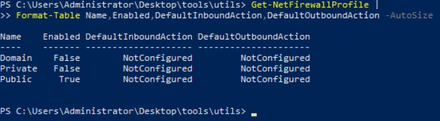
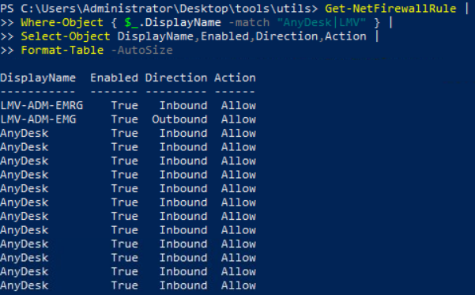
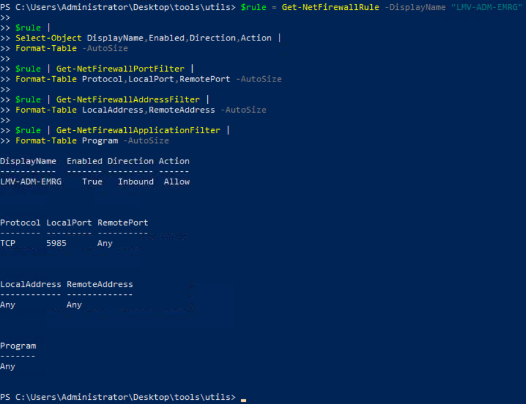

# 11 - Firewall Rule Audit

| Information | Details |
|---|---|
| Difficulty | Beginner |
| Category | Network Security & Host Hardening |
| Platform | TryHackMe |
| Practice Room | Windows Incident Surface |
| Technology | Windows Defender Firewall / PowerShell |

---

## Overview

In this lab, I reviewed the Windows firewall configuration of a Windows host and identified security-relevant firewall settings and remote-access rules.

The investigation focused on:

- firewall profile status
- enabled inbound rules
- remote administration exposure
- AnyDesk-related firewall rules
- a broad WinRM rule
- overly permissive source restrictions

The goal was not to label every unusual rule as malicious, but to identify rules that increased the attack surface and required further review.

---

## Learning Goal

My goal was to practice auditing Windows firewall rules from a defensive security perspective.

I wanted to understand how to review:

- firewall profile state
- rule direction
- Allow / Block actions
- local and remote ports
- remote address restrictions
- application restrictions

---

## Firewall Rule Enumeration

I used the provided firewall summary script to review configured rules:

```powershell
cd C:\Users\Administrator\Desktop\tools\utils
.\fw-summary.ps1 | Tee-Object -FilePath fw-rules.txt
```

The output included information such as:

```text
DisplayName
Protocol
LocalPort
RemotePort
RemoteAddress
Direction
Action
Program
```

This provided an overview of the host's firewall exposure.

---

# Finding 1 - Firewall Profile State

I reviewed the Windows firewall profiles using:

```powershell
Get-NetFirewallProfile |
Format-Table Name,Enabled,DefaultInboundAction,DefaultOutboundAction -AutoSize
```

The result showed:

```text
Domain   False
Private  False
Public   True
```

The Domain and Private firewall profiles were disabled while the Public profile remained enabled.



This configuration reduces host-level firewall protection when the machine is connected to networks classified as Domain or Private.

---

# Finding 2 - Remote Access Rules

I searched for firewall rules related to remote-access software and emergency administration:

```powershell
Get-NetFirewallRule |
Where-Object { $_.DisplayName -match "AnyDesk|LMV" } |
Select-Object DisplayName,Enabled,Direction,Action |
Format-Table -AutoSize
```

The results showed:

- multiple enabled `AnyDesk` inbound Allow rules
- an inbound `LMV-ADM-EMRG` Allow rule
- an outbound `LMV-ADM-EMRG` Allow rule



The presence of remote administration rules is not automatically malicious.

However, remote-access rules should be reviewed carefully because they can increase the system's externally reachable attack surface.

---

# Finding 3 - Overly Permissive WinRM Rule

I investigated the `LMV-ADM-EMRG` rule in more detail.

```powershell
$rule = Get-NetFirewallRule -DisplayName "LMV-ADM-EMRG"

$rule |
Select-Object DisplayName,Enabled,Direction,Action |
Format-Table -AutoSize

$rule | Get-NetFirewallPortFilter |
Format-Table Protocol,LocalPort,RemotePort -AutoSize

$rule | Get-NetFirewallAddressFilter |
Format-Table LocalAddress,RemoteAddress -AutoSize

$rule | Get-NetFirewallApplicationFilter |
Format-Table Program -AutoSize
```

The inbound rule showed:

```text
Enabled: True
Direction: Inbound
Action: Allow
Protocol: TCP
LocalPort: 5985
RemotePort: Any
LocalAddress: Any
RemoteAddress: Any
Program: Any
```



TCP port `5985` is commonly used by Windows Remote Management (WinRM) over HTTP.

The main security concern was not the use of WinRM itself.

The rule was overly broad because it allowed inbound access from:

```text
RemoteAddress: Any
```

and was not restricted to a specific application:

```text
Program: Any
```

For an administrative service, a safer configuration would normally restrict access to known management systems, trusted network ranges, or specific administrative requirements.

---

# Audit Summary

| Finding | Risk |
|---|---|
| Domain firewall disabled | Reduced host protection on domain networks |
| Private firewall disabled | Reduced protection on trusted/private networks |
| Multiple AnyDesk inbound Allow rules | Increased remote-access exposure |
| WinRM TCP/5985 exposed | Remote administration service reachable |
| `RemoteAddress = Any` | No source network restriction |
| `Program = Any` | No application-level restriction |

---

# Risk Assessment

The most significant finding was the inbound `LMV-ADM-EMRG` rule.

The rule allowed:

```text
Any remote source
        ↓
TCP 5985
        ↓
Inbound Allow
        ↓
Any program
```

This represents a broader access policy than would normally be preferred for a remote administration service.

I treated the rule as an overly permissive firewall configuration rather than claiming that it was malicious.

---

# Recommended Hardening

Possible defensive improvements include:

- enable firewall protection on all required profiles
- remove unnecessary remote-access rules
- review duplicate AnyDesk rules
- restrict WinRM access to authorised administrator systems
- replace `RemoteAddress: Any` with trusted management networks where possible
- disable unused remote administration services
- periodically audit enabled inbound Allow rules

Firewall changes should be tested before deployment to avoid disrupting legitimate administrative access.

---

# Evidence Collected

```text
screenshots/
├── 01-firewall-profile-state.png
├── 02-remote-access-firewall-rules.png
└── 03-lmv-emergency-winrm-rule-details.png
```

Only screenshots that demonstrated a meaningful audit finding were included.

---

# What I Practiced

During this lab, I practiced:

- enumerating Windows firewall rules
- reviewing firewall profile status
- identifying enabled inbound Allow rules
- analysing remote administration exposure
- reviewing protocol and port filters
- reviewing remote address restrictions
- reviewing application filters
- recognising overly permissive firewall rules
- separating misconfiguration findings from confirmed malicious activity
- proposing least-privilege firewall improvements

---

# Key Takeaways

## 1. An Allow rule is not automatically unsafe

Firewall rules must be evaluated in context.

An administrative service may legitimately require inbound access, but the source scope and application restrictions still matter.

## 2. Source restrictions are important

A rule using:

```text
RemoteAddress: Any
```

provides a much larger exposure surface than a rule limited to known management addresses.

## 3. Firewall profiles matter as much as individual rules

Even well-designed individual rules provide less protection if the firewall profile itself is disabled.

## 4. Remote administration requires tighter controls

Services such as WinRM and remote desktop tools provide valuable administration capabilities but also require careful network access controls.

---

# Result

In this lab, I audited the Windows firewall configuration and identified several security-relevant findings.

I found that the Domain and Private firewall profiles were disabled, reviewed multiple remote-access Allow rules, and analysed an inbound WinRM rule in detail.

The WinRM rule allowed TCP port `5985` from any remote address without an application restriction.

Rather than treating the rule as automatically malicious, I documented it as an overly permissive remote-management configuration that should be reviewed and hardened.

This lab gave me practical experience applying least-privilege principles to host-based firewall configuration.

---

## Next Step

The final portfolio lab will focus on phishing detection and suspicious email analysis.
