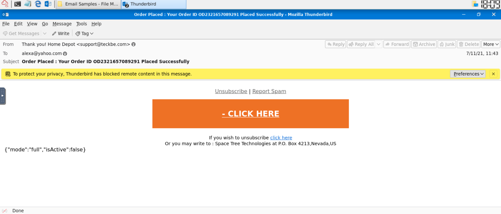
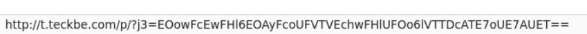
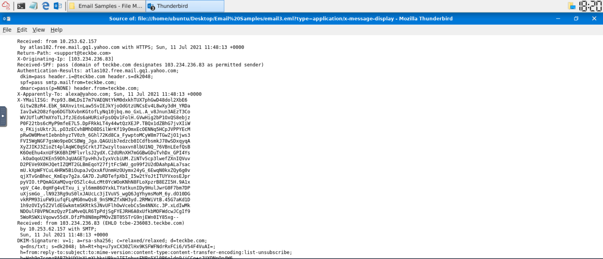

# 12 - Phishing Detection

| Information | Details |
|---|---|
| Difficulty | Beginner |
| Category | Email Security & Phishing Analysis |
| Platform | TryHackMe |
| Analysis Environment | Thunderbird |
| Sample | `email3.eml` |

---

## Overview

In this lab, I analysed a suspicious email by reviewing its visible sender information, embedded link destination, and raw message headers.

The email attempted to present itself as a Home Depot order notification, but the sender and link infrastructure belonged to an unrelated domain.

The investigation focused on:

- brand impersonation
- sender-domain mismatch
- suspicious link analysis
- email header inspection
- originating IP identification
- SPF, DKIM, and DMARC results

---

## Learning Goal

My goal was to practice identifying phishing indicators without clicking suspicious links or interacting with potentially malicious content.

I wanted to understand how the following pieces of evidence can be combined:

```text
Display name
+
Sender domain
+
Link destination
+
Authentication results
+
Message headers
```

---

## Initial Email Review

I opened the email sample in Thunderbird.

The message presented itself as an order notification associated with:

```text
Home Depot
```

The visible sender information was:

```text
Thank you! Home Depot <support@teckbe.com>
```

The subject was:

```text
Order Placed : Your Order ID OD2321657089291 Placed Successfully
```

The body contained a prominent:

```text
CLICK HERE
```

button.



---

## Suspicious Indicators

Several indicators made the email suspicious.

### Brand and Domain Mismatch

The email visually referenced:

```text
Home Depot
```

but the sender domain was:

```text
teckbe.com
```

The sender domain therefore did not match the organisation the message claimed to represent.

### Social Engineering

The subject referenced an unexpected order confirmation.

This type of message can create urgency or curiosity and encourage a recipient to click a link to investigate an unfamiliar transaction.

### Remote Content

Thunderbird automatically blocked remote content in the email.

I did not enable the remote content during the investigation.

---

# Link Analysis

Instead of clicking the large `CLICK HERE` button, I hovered over it and inspected the destination displayed by Thunderbird.

The link pointed to:

```text
http://t.teckbe.com/p/?j3=...
```



Important observations included:

- the link did not use a Home Depot domain
- the destination used the same unrelated `teckbe.com` infrastructure
- the connection used `HTTP`
- the URL contained a long encoded-looking parameter

I did not visit the destination.

---

# Email Header Analysis

I opened the raw email source in Thunderbird and reviewed the message headers.

Important fields included:

```text
Return-Path: <support@teckbe.com>
X-Originating-IP: [103.234.236.83]
```

Authentication results showed:

```text
SPF: pass
DKIM: pass
DMARC: pass
```



---

## Authentication Interpretation

The successful authentication results were an important part of the analysis.

The email passed SPF, DKIM, and DMARC checks for the domain:

```text
teckbe.com
```

This means the message was authorised to send mail on behalf of `teckbe.com`.

However, that does **not** prove that the message was legitimate Home Depot email.

The message still presented itself using Home Depot branding while being sent from an unrelated authenticated domain.

This demonstrates an important phishing-analysis principle:

```text
SPF / DKIM / DMARC PASS
does not automatically mean
the email is trustworthy
```

Email authentication helps validate the sending domain, but analysts must still evaluate the sender's identity, branding, links, content, and context.

---

# Indicator Summary

| Type | Indicator |
|---|---|
| Displayed Brand | `Home Depot` |
| Sender | `support@teckbe.com` |
| Sender Domain | `teckbe.com` |
| Return-Path | `support@teckbe.com` |
| Link Domain | `t.teckbe.com` |
| Link Protocol | `HTTP` |
| Originating IP | `103.234.236.83` |
| SPF | `pass` |
| DKIM | `pass` |
| DMARC | `pass` |

---

# Investigation Flow

```text
Suspicious order email
        ↓
Home Depot branding
        ↓
Sender domain mismatch
        ↓
support@teckbe.com
        ↓
Hovered over embedded link
        ↓
t.teckbe.com
        ↓
Raw header analysis
        ↓
Originating IP identified
        ↓
SPF / DKIM / DMARC reviewed
        ↓
Brand impersonation confirmed
```

---

# Final Assessment

I classified the email as a phishing / brand-impersonation attempt.

The strongest indicators were:

- Home Depot branding from an unrelated domain
- the sender address `support@teckbe.com`
- a call-to-action link pointing to `t.teckbe.com`
- an unexpected order-themed message designed to encourage user interaction

The email authentication checks passing did not remove these indicators because SPF, DKIM, and DMARC authenticated `teckbe.com`, not Home Depot.

---

# Evidence Collected

```text
screenshots/
├── 01-phishing-email-overview.png
├── 02-phishing-link-target.png
└── 03-email-header-analysis.png
```

Only screenshots that demonstrated a distinct investigation step were included.

---

# What I Practiced

During this lab, I practiced:

- reviewing suspicious emails safely
- identifying brand impersonation
- identifying sender-domain mismatches
- inspecting links without clicking them
- reviewing raw email headers
- identifying Return-Path information
- identifying originating IP addresses
- interpreting SPF results
- interpreting DKIM results
- interpreting DMARC results
- distinguishing domain authentication from message legitimacy
- documenting email indicators
- producing an evidence-based phishing verdict

---

# Key Takeaways

## 1. Display names cannot be trusted alone

A message can display a well-known company name while being sent from a completely unrelated domain.

The actual sender address and domain must always be reviewed.

---

## 2. Links should be inspected before clicking

Hovering over the link allowed me to identify:

```text
t.teckbe.com
```

without visiting the destination.

This provided useful evidence while avoiding unnecessary interaction with the suspicious infrastructure.

---

## 3. Email authentication is not the same as trust

This email passed:

```text
SPF
DKIM
DMARC
```

but the authenticated domain was still unrelated to the organisation being impersonated.

Authentication controls can help detect spoofing, but they do not prevent every form of phishing or brand impersonation.

---

## 4. Multiple indicators provide a stronger verdict

No single field was used as the entire basis for the verdict.

The assessment was based on the combination of:

```text
Brand mismatch
+
Sender domain
+
Link destination
+
Message content
+
Header evidence
```

---

# Result

In this lab, I analysed a suspicious email using Thunderbird and identified a brand-impersonation phishing attempt.

I reviewed the visible sender information, safely inspected the embedded link, extracted infrastructure indicators from the raw headers, and evaluated SPF, DKIM, and DMARC results.

The most important lesson was that a technically authenticated email can still be malicious or deceptive when the authenticated domain is being used to impersonate another organisation.

This lab completed the phishing-analysis section of my TryHackMe security portfolio.
